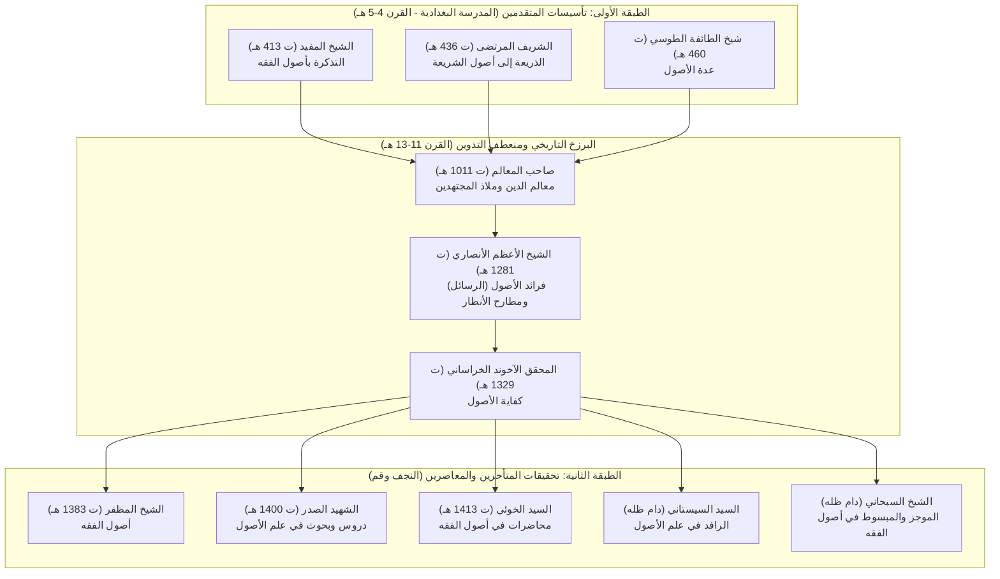

# منصة الاستنباط الحوزوية التفاعلية — دراسة «الموجز في أصول الفقه» مع الشيخ شبير
## Hawzawi Digital Academic Platform: Advanced Usul al-Fiqh Curriculum

> **بيئة دراسية وأكاديمية حوزوية متكاملة تجمع بين أصالة الدرس الحوزوي المعمق وأحدث تقنيات الويب التفاعلية، مخصصة لدراسة متن «الموجز في أصول الفقه» لآية الله العظمى الشيخ جعفر السبحاني (دام ظله) مع فضيلة الأستاذ الشيخ شبير.**

---

## الفهرس العام (Table of Contents)
1. [رؤية المشروع والمنهجية التعليمية](#1-رؤية-المشروع-والمنهجية-التعليمية)
2. [الهندسة البنائية للدروس (نظام التبويبات السبعة الموحد)](#2-الهندسة-البنائية-للدروس-نظام-التبويبات-السبعة-الموحد)
3. [المنظومة المقارنة ثنائية الطبقات (المتقدمون والمتأخرون)](#3-المنظومة-المقارنة-ثنائية-الطبقات-المتقدمون-والمتأخرون)
4. [خزانة المصادر الأصولية الـ 15 المعتمدة](#4-خزانة-المصادر-الأصولية-الـ-15-المعتمدة)
5. [التطبيقات والأدوات الحوزوية المستقلة](#5-التطبيقات-والأدوات-الحوزوية-المستقلة)
6. [سجل الإنجازات وما تم إنجازه بدقة (What We Did)](#6-سجل-الإنجازات-وما-تم-إنجازه-بدقة-what-we-did)
7. [توجيهات المستخدم وثوابت التصميم (What I Want)](#7-توجيهات-المستخدم-وثوابت-التصميم-what-i-want)
8. [خريطة الطريق والخطوات القادمة (What's Next)](#8-خريطة-الطريق-والخطوات-القادمة-whats-next)
9. [دليل الاستخدام والهيكل التقني للمستودع](#9-دليل-الاستخدام-والهيكل-التقني-للمستودع)

---

## 1. رؤية المشروع والمنهجية التعليمية

### أ) فلسفة المنصة
الدرس الحوزوي الأصيل ليس مجرد تلقٍ سلبي للمعلومة، بل هو **صناعة للملكة الفقهية والأصولية**، وتدريب مستمر على تفكيك العبارة، وتحرير محل النزاع، وتتبع المسالك الاستدلالية، وربط القواعد الأصولية النظرية بالفروع الفقهية العملية.
جاء هذا المشروع ليوثق مسار دراسة متن **«الموجز في أصول الفقه»** مع الأستاذ الفاضل **سماحة الشيخ شبير**، محولاً المحاضرات الصوتية والمذكرات إلى محطة عمل أكاديمية متطورة تتيح:
- المطالعة الاستباقية للدروس وتوليد الإشكالات المسبقة.
- استيعاب تقرير الدرس الموحد بنكاته الدقيقة وأدلته الصناعية.
- مقارنة رأي المصنف مع المدارس الأصولية الست الكبرى عبر حقبتي المتقدمين والمتأخرين.
- ربط كل قاعدة أصولية بفرع تطبيقي من *العروة الوثقى* وبسندها الروائي من *وسائل الشيعة*.
- تثبيت المعلومات عبر المشجرات الذهنية وأنظمة الاستذكار النشط (Active Recall).

### ب) مبدأ الاستغناء الكامل عن التعرف الضوئي (Zero OCR Policy)
اعتمد المشروع بنسبة **100%** على المكتبات الحوزوية المرقمنة والمفهرسة بصيغة ماركداون (`.md`) المتاحة محلياً في مجلد `Resources/` (مكتبة أهل البيت ومكتبة نور)، متجاوزاً عيوب القراءة الضوئية لملفات الـ PDF. وقد تم ربط نصوص الدروس بـ **3,142 صفحة مفهرسة بدقة السطر والصفحة** من أمهات المصادر الأصولية.

---

## 2. الهندسة البنائية للدروس (نظام التبويبات السبعة الموحد)

تم اعتماد معمارية موحدة وصارمة لجميع دروس الدورة تلتزم بـ **نظام التبويبات السبعة (7-Tab System)**، رافضين نظام الشريط العمودي الطويل (Single-Page Long Strip) منعاً لتشتت الطالب ولإتاحة تركيز ذهني كامل لكل مرحلة:

```
┌─────────────────────────────────────────────────────────────────────────────────────────────┐
│  التبويب 0: 🧭 النظرة العامة والمشجر التفاعلي (Overview & Quick Cards)                      │
│  ├─ بطاقات تحرير محل النزاع، القواعد الجوهرية، ومسار الدرس.                                │
│  └─ مشجر تدفق الأفكار الأصولية برسم Mermaid التفاعلي.                                      │
├─────────────────────────────────────────────────────────────────────────────────────────────┤
│  التبويب 1: 📖 المرحلة الأولى: التحضير المسبق (Pre-Lecture Dossier)                          │
│  ├─ المتن الكامل لفقرة كتاب «الموجز» محل الشرح.                                             │
│  ├─ تفكيك المفردات والاصطلاحات اللغوية والصناعية الغامضة.                                   │
│  └─ بنك أسئلة وإشكالات التحضير الذكية لطرحها على الشيخ شبير في جلسة الدرس.                  │
├─────────────────────────────────────────────────────────────────────────────────────────────┤
│  التبويب 2: 🎙️ المرحلة الثانية: تقرير الدرس الموحد (Unified Lecture Synthesis)              │
│  ├─ خلاصة تقرير أبحاث الشيخ شبير الموحدة مع المتن.                                          │
│  ├─ الأقوال والمسالك في المسألة مفرقة بالنصوص والبراهين.                                    │
│  └─ حواشٍ بيانية وتنبيهات أصولية منهجية.                                                    │
├─────────────────────────────────────────────────────────────────────────────────────────────┤
│  التبويب 3: ⚖️ المرحلة الثالثة: المقارنة الحوزوية ونصوص الشروح (Seminary Comparative Study)   │
│  ├─ الطبقة الأولى: تأسيسات المتقدمين (المدرسة البغدادية: المفيد، المرتضى، الطوسي).          │
│  ├─ جدول المقارنة الجوهرية بين منهج المتقدمين ومنهج المتأخرين.                              │
│  └─ الطبقة الثانية: تحقيقات المتأخرين والمعاصرين (مبدل المدارس الست التفاعلي).              │
├─────────────────────────────────────────────────────────────────────────────────────────────┤
│  التبويب 4: 🕌 المرحلة الرابعة: التطبيق الفقهي والتفريعات (Applied Jurisprudence)            │
│  ├─ الفرع الفقهي التطبيقي المباشر من «العروة الوثقى» للسيد اليزدي.                          │
│  ├─ أثر اختلاف المبنى الأصولي في الفتوى العملية المعاصرة (الخوئي، السيستاني، الصدر).        │
│  └─ الشواهد الروائية والحديثية المسندة من «وسائل الشيعة» للحر العاملي.                      │
├─────────────────────────────────────────────────────────────────────────────────────────────┤
│  التبويب 5: 🧠 المرحلة الخامسة: المشجر والاستذكار النشط (Active Recall System)               │
│  ├─ مشجر تفصيلي متقدم يربط المسألة بالأصول العملية والحجج.                                 │
│  └─ بطاقات الاستذكار النشط مع إمكانية إخفاء الإجابة واختبار الحفظ والاستنباط الذاتي.       │
├─────────────────────────────────────────────────────────────────────────────────────────────┤
│  التبويب 6: 📚 المرحلة السادسة: خزانة المصادر والنصوص (The 15-Source Primary Vault)         │
│  ├─ 15 بطاقة متطابقة للمصادر الأصولية المعتمدة بتوثيق الصفحات والأجزاء.                     │
│  ├─ زر «📖 فتح بالدرج الجانبي» لمطالعة الشاهد مع تثبيت سياق الدرس.                         │
│  ├─ زر «📑 قراءة المبحث كاملاً» لفتح نافذة الصفحات المتتالية (± صفحات) والبحث المباشر.     │
│  └─ زر «📋 نسخ النص» لنسخ النص المحقق فوراً إلى الحافظة.                                    │
└─────────────────────────────────────────────────────────────────────────────────────────────┘
```

---

## 3. المنظومة المقارنة ثنائية الطبقات (المتقدمون والمتأخرون)

تتميز المنصة بتجاوز حصر المقارنات في كتب المتأخرين؛ حيث تم تشييد **إطار تاريخي وصناعي مقارن ثنائي الطبقات** في التبويب الثالث:



### الفوارق الجوهرية المحررة بين المدرستين:
| وجه المقارنة | مدرسة المتقدمين (بغداد) | مدرسة المتأخرين والمعاصرين (النجف وقم) |
| :--- | :--- | :--- |
| **المناط الإبستيمولوجي** | التمسك بالقطع واليقين، ورفض العمل بالظن وخبر الواحد المجرد (المرتضى)، أو قبوله إذا اقترن بقرائن قطعية وموثوقية الصدور (المفيد والطوسي). | تأسيس حجية الظنون الخاصة المعتبرة (خبر الثقة، أصالة الظهور) بجعل الشارع وإمضاء العقلاء، والتوسع في تأسيس الأصول العملية الجعلية. |
| **موضوع علم الأصول** | حصر الموضوع في خصوص «الأدلة الأربعة» بما هي أدلة (الكتاب، السنة، الإجماع، دليل العقل). | تمايز العلوم بالأغراض الداعية للتدوين (الآخوند)، أو إسقاط شرط الموضوع الواحد، وتعريف الأصول بـ «العناصر المشتركة» (الصدر). |
| **حقيقة الوضع اللغوي** | المواضعة والتواطؤ العرفي والشرعي لإبانة المقاصد دون إغراق في فلسفة الربط الذهني. | تشريح فلسفي وسيكولوجي معمق: التعهد النفساني (الخوئي)، القرن الأكيد المشفر (الصدر)، أو النظام الاعتباري الاجتماعي (السيستاني). |
| **دلالة الألفاظ** | انقسام الدلالة بحسب التواضع مع اشتراط قصد الإبانة لإفادة الأحكام وإخراج كلام الساهي والنائم. | التفكيك الصناعي الثلاثي: الدلالة التصورية الوضعية، الدلالة التفهيمية الاستعمالية، والدلالة التصديقية الجدية القائمة على أصالة التطابق. |

---

## 4. خزانة المصادر الأصولية الـ 15 المعتمدة

تم توحيد خزانة النصوص الأصلية في **المرحلة السادسة (التبويب 6)** في جميع الدروس لتشمل **15 كتاباً ومصدراً محققاً** تغطي كافة الحقب التاريخية والمدارس الأصولية، مزودة بأدوات الفتح في الدرج الجانبي ومطالعة الصفحات التامة:

| الرقم | اسم المصدر المعتمد | المؤلف والمحقق | الحقبة / المنهج | الدور في المنصة |
| :---: | :--- | :--- | :---: | :--- |
| **01** | **التذكرة بأصول الفقه** | الشيخ المفيد محمد بن محمد بن النعمان (ت 413 هـ) | متقدمين | أقدم تلخيص أصولي إمامي واصل في حصر مدارك الأحكام. |
| **02** | **الذريعة إلى أصول الشريعة (ج 1 و 2)** | الشريف المرتضى علم الهدى علي بن الحسين (ت 436 هـ) | متقدمين | المصنف الأصولي البغدادي الأكبر المؤسس للعقلانية ونفي حجية الآحاد. |
| **03** | **عدة الأصول (ج 1 و 2)** | شيخ الطائفة أبو جعفر الطوسي (ت 460 هـ) | متقدمين | جامع أصول الإمامية ومؤسس حجية خبر الثقة المتحرز عن الكذب. |
| **04** | **معالم الدين وملاذ المجتهدين** | الشيخ حسن بن الشهيد الثاني (ت 1011 هـ) | متأخرين | المتن الكلاسيكي الحوزوي الذي استقرت عليه الحوزات لقرون. |
| **05** | **فرائد الأصول (الرسائل) ومطارح الأنظار** | الشيخ الأعظم مرتضى الأنصاري (ت 1281 هـ) | متأخرين | المحطة الانقلابية الكبرى في تأسيس مباحث الحجج والأصول العملية. |
| **06** | **كفاية الأصول (ج 1 و 2)** | المحقق الآخوند محمد كاظم الخراساني (ت 1329 هـ) | متأخرين | قمة التدقيق الأصولي التجريدي وتأسيس تمايز العلوم بالأغراض. |
| **07** | **الموجز في أصول الفقه** | آية الله العظمى الشيخ جعفر السبحاني (دام ظله) | معاصرين | **المتن الأساسي المعتمد** في شرح ودروس الشيخ شبير. |
| **08** | **المبسوط في أصول الفقه (4 مجلدات)** | آية الله العظمى الشيخ جعفر السبحاني (دام ظله) | معاصرين | الشرح الموسع والمفصل للمصنف وميدان التحقيقات المعاصرة. |
| **09** | **أصول الفقه (ج 1 و 2)** | العلامة الشيخ محمد رضا المظفر (ت 1383 هـ) | معاصرين | المتن الأكاديمي الحوزوي المنهجي المعتمد في مرحلة السطوح الوسطى. |
| **10** | **دروس في علم الأصول (الحلقات 1 و 2)** | الشهيد السعيد السيد محمد باقر الصدر (ت 1400 هـ) | معاصرين | المنظومة التعليمية الحديثة المبنية على العناصر المشتركة. |
| **11** | **بحوث في علم الأصول (موسوعة الشاهرودي)** | تقرير السيد محمود الهاشمي الشاهرودي لأبحاث الصدر | معاصرين | التحليل الصناعي الأعمق لمدرسة الشهيد الصدر في أبحاث الخارج. |
| **12** | **محاضرات في أصول الفقه ومصباح الأصول** | الإمام السيد أبو القاسم الخوئي (ت 1413 هـ) | معاصرين | عمدة أبحاث مدرسة النجف الأشرف الحديثة ومسلك التعهد. |
| **13** | **الرافد في علم الأصول** | تقرير السيد منير الخباز لأبحاث السيد السيستاني | معاصرين | المنهج التاريخي والارتكازات العقلائية ونظام الاعتبار الاجتماعي. |
| **14** | **العروة الوثقى** | السيد محمد كاظم الطباطبائي اليزدي (ت 1337 هـ) | فقه وتطبيقات | المصدر الفقهي التطبيقي المعتمد لبيان ثمرات القواعد الأصولية. |
| **15** | **وسائل الشيعة إلى تحصيل مسائل الشريعة** | المحدث الشيخ الحر العاملي (ت 1104 هـ) | حديث واستدلال | المستند الروائي والحديثي المعتمد لاستخراج أدلة المسائل ومنابعها. |

---

## 5. التطبيقات والأدوات الحوزوية المستقلة

بجانب ملفات الدروس، تم تزويد المنصة بثلاثة تطبيقات ويب مستقلة تعمل محلياً دون الحاجة إلى إنترنت:

### أ) المعجم الأصولي والفقهي الشامل (`Usul/Master_Dictionary.html`)
- **المصادر المعتمدة:** مستخرج ومبني مباشرة من 5 معاجم حوزوية معتمدة:
  1. *مصطلحات الفقه* — الشيخ علي المشكيني.
  2. *موسوعة مصطلحات أصول الفقه عند المسلمين* — رفيق العجم.
  3. *معجم ألفاظ الفقه الجعفري* — د. أحمد فتح الله.
  4. *الاصطلاحات الفقهية في الرسائل العملية* — الشيخ ياسين عيسى العاملي.
  5. *معجم لغة الفقهاء* — د. محمد قلعجي.
- **المصطلحات المستدركة:** تم إدراج المصطلحات الدقيقة التي كان يفتقر إليها المعجم مثل: **الدليل الإجمالي**، **الدليل التفصيلي**، **العلم الإجمالي**، **الحكومة والورود**، **الأمارات والأصول العملية**، ومصطلحات الفتوى في الرسائل العملية (*الأحوط وجوباً*، *الأظهر*، *الأقوى*، *فيه إشكال*).
- **البطاقة التحليلية السباعية (7-Facet Term Card):** يقدم المعجم لكل مصطلح ملفاً شاملاً يضم:
  1. التعريف اللغوي والاصطلاحي الدقيق مع اسم المعجم والصفحة.
  2. المنشأ التاريخي وتطور المصطلح بين المتقدمين والمتأخرين.
  3. الأقسام والتفريعات الحوزوية للمصطلح.
  4. الشواهد القرآنية والحديثية من الآيات والروايات.
  5. التطبيق الفقهي العملي المعاصر من فتاوى المراجع.
  6. بطاقة الفروق التناظرية السريعة (المصطلحات المتشابهة).
  7. رابط القفز المباشر لموضع شرح المصطلح في قارئ الكتب التراثي.

### ب) قارئ الكتب الحوزوي التراثي (`Usul/Book_Reader.html`)
- قارئ كتب إلكتروني حوزوي مستقل مفهرس لـ **10 مجلدات كاملة (3,142 صفحة)** من أمهات المصادر.
- فهرس تفصيلي للأبواب والفصول مع شريط قفز رقمي سريع للصفحات.
- محرك بحث نصي فوري في كامل صفحات المجلد مع تظليل النتائج.
- تحكم كامل بحجم الخط، والمسافات، والسمات البصرية (نهاري / ليلي / ورقي قديم).
- إمكانية فتح أي صفحة مطلوبة من خلال بارامترات الرابط مباشرة (مثال: `Book_Reader.html?book=murtada_dhariyah_1&page=22`).

### ج) خريطة المنهج الحوزوي الشاملة (`Usul/Curriculum_Map.md`)
- خريطة تفصيلية تضم **26 درساً أصولياً** تغطي كافة أبواب كتاب *الموجز في أصول الفقه*:
  - **المقدمة والمبادئ:** الدروس 01 إلى 05 (التعريف، الوضع، الدلالات، تقسيم الألفاظ، المشتق).
  - **مباحث الألفاظ:** الدروس 06 إلى 19 (الأوامر، النواهي، المفاهيم، العموم والخصوص، المطلق والمقيد).
  - **الملازمات العقلية والأدلة:** الدروس 20 إلى 26 (المستقلات العقلية، الحجج، الأمارات، الأصول العملية، التعادل والتراجيح).

---

## 6. سجل الإنجازات وما تم إنجازه بدقة (What We Did)

1. **إعادة بناء وهندسة الدروس 01 و 02 و 03 معمارياً:**
   - تحويل الملفات بالكامل إلى معمارية التبويبات السبعة الموحدة (`#tabs-nav` و `.tab-pane`).
   - القضاء التام على مشاكل الانزلاق والانجراف التنسيقي (Layout Drift) واستبدال التنسيقات الفردية المضمنة بـ Tailwind CSS النقي.
   - تفعيل سمة التبديل اللوني (Dark/Light Theme) مع الحفظ التلقائي في `localStorage`.
2. **دمج مدرسة المتقدمين البغدادية (The Baghdad Triumvirate):**
   - كتابة وبناء بطاقات تأسيسات الشيخ المفيد (*التذكرة*)، والشريف المرتضى (*الذريعة*)، والشيخ الطوسي (*العدة*) في التبويب الثالث لكل درس.
   - وضع جداول مقارنة منهجية بين مدرسة بغداد ومدرسة النجف وقم المعاصرة.
3. **ترقية خزانة المصادر من 8 مصادر إلى 15 مصدراً كاملاً:**
   - توسيع شبكة البطاقات في التبويب السادس عبر الدروس الثلاثة لتعرض 15 مصدراً حوزوياً كاملاً.
   - تزويد كل بطاقة بنصوص ومقتبسات محققة من الكتاب المعني بالمسألة نفسها.
   - ربط أزرار «فتح بالدرج» و«قراءة المبحث كاملاً (± صفحات)» بقواميس بيانات `SOURCE_TEXTS` و `FULL_PAGES_DATA` لجميع المصادر الـ 15 دون أي كسر أو خطأ برمجي.
4. **تطوير ونشر المعجم الأصولي وقارئ الكتب التراثي:**
   - توليد قاعدة بيانات `dictionary_db.js` و `books_db.js` من ملفات الماركداون المحلية.
   - بناء واجهتي `Master_Dictionary.html` و `Book_Reader.html`.
5. **الفحص والتحقق الآلي الصارم (Automated Verification Pipeline):**
   - كتابة سكريبتات فحص برمجية متخصصة (`verify_all_lessons.py` و `verify_15_books.py`).
   - تحقيق نسبة نجاح **100%** في مطابقة عدد التبويبات (7)، وبطاقات الخزانة (15)، وسلامة كافة دوال الاستدعاء.

---

## 7. توجيهات المستخدم وثوابت التصميم (What I Want)

لضمان استمرار العمل بنفس الروح والمعايير في الدروس القادمة، تم توثيق تفضيلات وشروط المستخدم كقواعد قطعية:

1. **الالتزام الحصري بنظام التبويبات السبعة (No Single Vertical Scrolling):**
   - يُمنع منعاً باتاً عرض الدرس في صفحة واحدة طويلة ذات تمرير مستمر؛ بل يجب أن ينفصل كل طور من أطوار الدرس في تبويبه الخاص المستقل منعاً للتشتت ولضمان تنظيم الذهن.
2. **الاعتماد الكلي على نصوص الماركداون المحلية دون مسح ضوئي (Zero OCR):**
   - عدم اللجوء لأي مكتبات OCR طالما تتوفر نصوص كتب مكتبة أهل البيت ونور في صيغة `.md` محلياً داخل `Resources/`.
3. **الهوية البصرية الحوزوية الوقورة:**
   - استخدام خطوط رصينة ومعتمدة في التراث الإسلامي (خطوط المصحف الشريف، Amiri، Scheherazade New).
   - استخدام لوحات ألوان حوزوية دافئة (تدرجات الكهرمان والذهب والعاجي في الوضع الفاتح، وتدرجات الزيتوني والأردوازي والذهبي الخافت في الوضع الليلي).
4. **العمق التراثي والمقارن المتوازن:**
   - عدم الاكتفاء بآراء المتأخرين (الآخوند، المظفر، الصدر، الخوئي)؛ بل يجب دوماً استحضار مدرسة المتقدمين (المفيد، المرتضى، الطوسي) لإبراز التطور التاريخي للمسألة.
5. **التطبيق الفقهي الحي (العروة والوسائل):**
   - كل درس يجب أن يتضمن فرعاً فقهياً تطبيقياً من *العروة الوثقى* وشاهداً روائياً من *وسائل الشيعة*، لإبراز ثمرة علم الأصول العملية وتجنيب الطالب الجدل النظري المجرد.
6. **التفاعلية الفورية والربط الرقمي:**
   - إتاحة درج جانبي متحرك للشواهد السريعة.
   - نافذة مطالعة الصفحات الكاملة متضمنة الصفحات السابقة واللاحقة مع أرقامها المحققة.
   - تفعيل النسخ الفوري بضغطة زر وتوليد بطاقات الاستذكار القابلة للطي.

---

## 8. خريطة الطريق والخطوات القادمة (What's Next)

### المرحلة الأولى: استكمال بقية مباحث المقدمة والألفاظ (الدروس 04 إلى 10)
- [ ] **الدرس 04:** المشترك اللفظي، الحقيقة والمجاز، واستعمال اللفظ في أكثر من معنى.
- [ ] **الدرس 05:** الحقيقة الشرعية، وحقيقة المشتق ومحل النزاع في التلبس والانقضاء.
- [ ] **الدرس 06:** الأوامر: مادة الأمر، صيغة افعل، ودلالتها على الوجوب التعييني العيني النفسي.
- [ ] **الدرس 07:** الإطلاق البدلي، التوصلي والتعبدي، وسقوط الأمر بامتثال المأمور به.
- [ ] **الدرس 08:** الأمر بعد الحظر، والوجوب التخييري والكفائي والموسع والمضيق.
- [ ] **الدرس 09:** النواهي: مادة النهي وصيغته ودلالتها على الحرمة والدوام والكف.
- [ ] **الدرس 10:** المفاهيم: ضابط المفهوم، مفهوم الشرط، ومفهوم الوصف والحصر والغاية.

### المرحلة الثانية: مباحث الأدلة والحجج والأصول العملية (الدروس 11 إلى 26)
- [ ] **الدروس 11 - 18:** العموم والخصوص، المطلق والمقيد، والمجمل والمبين.
- [ ] **الدروس 19 - 22:** حجية القطع، إمكان التعبد بالظن، حجية الكتاب وخبر الثقة.
- [ ] **الدروس 23 - 26:** الأصول العملية (البراءة، الاحتياط، التخيير، الاستصحاب) وخاتمة التعارض.

### المرحلة الثالثة: المزايا التقنية والتكاملية المتقدمة
- [ ] **المزامنة الصوتية (Audio-Timestamp Sync):** ربط نقاط تقرير الدرس بالتسجيل الصوتي لجلسات الشيخ شبير عند توفرها.
- [ ] **تصدير بطاقات أنكي الحوزوية (Anki Deck Exporter):** تصدير أسئلة التبويب الخامس بضغطة زر إلى حزم تكرار متباعد جاهزة للمراجعة اليومية.
- [ ] **المساعد الحوزوي التفاعلي (Interactive Seminary Tutor):** إدماج واجهة حوارية محلية تعتمد على قواعد بيانات الدروس للإجابة على إشكالات الطالب ومحاكاة المباحثة الحوزوية.

---

## 9. دليل الاستخدام والهيكل التقني للمستودع

### أ) تشغيل المنصة
المنصة مصممة لتعمل **100% محلياً ودون أي خادم ويب معقد (Pure Offline-First)**:
1. افتح أي ملف من ملفات الدروس داخل متصفحك المفضل (مثل Google Chrome أو Edge أو Firefox):
   - `Usul/00_المقدمة_والمبادئ/01_تعريف_علم_الأصول_وموضوعه_وغايته.html`
   - `Usul/00_المقدمة_والمبادئ/02_تقسيم_المباحث_وحقيقة_الوضع_وأقسامه.html`
   - `Usul/00_المقدمة_والمبادئ/03_الدلالة_التصورية_والدلالة_التصديقية.html`
2. لفتح المعجم الحوزوي الشامل: افتح `Usul/Master_Dictionary.html`.
3. لفتح قارئ الكتب التراثي: افتح `Usul/Book_Reader.html`.

### ب) هيكل المجلدات والملفات في المشروع

```text
Shaykh Shabbir/
├── README.md                              # دليل المنصة الشامل وخارطة المشروع (هذا الملف)
├── Usul/
│   ├── 00_المقدمة_والمبادئ/               # مجلد دروس المقدمة والمبادئ العامة
│   │   ├── 01_تعريف_علم_الأصول_وموضوعه_وغايته.html
│   │   ├── 02_تقسيم_المباحث_وحقيقة_الوضع_وأقسامه.html
│   │   └── 03_الدلالة_التصورية_والدلالة_التصديقية.html
│   ├── Master_Dictionary.html             # تطبيق المعجم الأصولي والفقهي الشامل
│   ├── Book_Reader.html                   # تطبيق قارئ الكتب التراثية المفهرس
│   ├── Curriculum_Map.md                  # خريطة المنهج الحوزوي الـ 26 درساً
│   └── Resources/                         # قواعد البيانات والبيانات المستخرجة
│       ├── dictionary_data/
│       │   └── dictionary_db.js           # قاعدة بيانات المعجم (100+ مصطلح حوزوي)
│       └── books_data/
│           └── books_db.js                # قاعدة بيانات قارئ الكتب (3,142 صفحة مفهرسة)
├── Resources/                             # المكتبات الحوزوية الخام المستخرجة
│   ├── AhlulBayt Library/                 # كتب مكتبة أهل البيت (ماركداون محقق)
│   └── Noor Library/                      # كتب مكتبة نور التخصصية
└── scripts/                               # أدوات وسكريبتات البناء والفحص الآلي
    ├── build_15_sources.py                # مولد بيانات المصادر الـ 15
    ├── execute_15_books_update.py         # سكريبت تحديث الدروس وحقن المصادر
    └── verify_15_books.py                 # سكريبت الفحص والتحقق الآلي الصارم
```

---

> **«إنَّ عِلْمَ الأُصُولِ مِيزَانُ الفِقْهِ، وَمِعْيَارُ الاسْتِنْبَاطِ، وَبِهِ يَعْتَصِمُ الفَقِيهُ عَنِ الزَّلَلِ فِي اسْتِخْرَاجِ الأَحْكَامِ الشَّرْعِيَّةِ مِنْ مَدَارِكِهَا المُعْتَبَرَةِ.»**
> *وفقكم الله وسدد خطاكم في مدارج الفقه والاجتهاد.*
