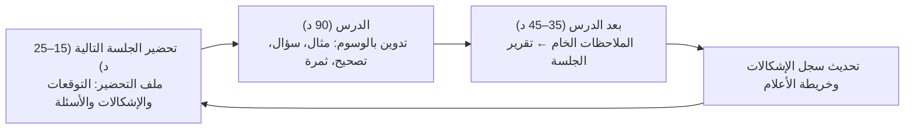

# برنامج دراسة «الموجز في أصول الفقه» مع الشيخ شبير

مرحباً بك في مستودع ومذكرات دراسة علم أصول الفقه الحوزوي. يمثل هذا المستودع بيئة متكاملة لمتابعة، تحضير، وتوثيق دروس كتاب **«الموجز في أصول الفقه» لآية الله الشيخ جعفر السبحاني (دام ظله)** مع أستاذك الفاضل **سماحة الشيخ شبير**، مع تعميق كل مسألة بدراسة مقارنة مع كبريات المتون الحوزوية (**أصول المظفر** و**حلقات الشهيد الصدر**)، واستنباط شواهدها من **القرآن الكريم** و**وسائل الشيعة**، وربطها بالتفاريع الفقهية في **العروة الوثقى**.

---

## 1. الدورة اليومية: تحضير ← درس ← تقرير

درس الشيخ شبير **يومي** (90 دقيقة)، ويغطي نحو **5 صفحات** من الموجز في الجلسة. لذلك وحدة الدراسة هي **الجلسة** لا الموضوع، والطبقة الأساسية هي **شرح الشيخ**. فالموجز نفسه يترك «التفصيل والشرح إلى الأستاذ» (مقدمة المؤلف ص 6).



1. **قبل الدرس:** افتح ملف تحضير الجلسة في `الجلسات/`. اقرأ الصفحات، وأجب عن أسئلة التحضير، واختر سؤالين للدرس.
2. **في الدرس:** دوّن بالوسوم `[مثال] [سؤال] [تصحيح] [ثمرة] [إحالة] [علم] [متن]`، ولكل مثال: *ماذا أثبت؟*
3. **بعد الدرس:** احفظ الملاحظات كما هي في `الجلسات/ملاحظات_خام/جلسة_NN.md`، ثم يُحوَّل ملف التحضير إلى تقرير (انظر [القالب](Templates/قالب_جلسة_الشيخ_شبير.md))، ويُبنى تحضير الجلسة التالية.
4. **أسبوعياً (نحو 60 د):** مراجعة أسئلة الجلسات، و[سجل الإشكالات المفتوحة](سجل_الإشكالات_المفتوحة.md)، و«للتوسع» إن اتسع الوقت.

| الجلسة | الموجز | الملف |
|:-:|---|---|
| 01 | تمهيدية | [الجلسة التمهيدية](الجلسات/01_الجلسة_التمهيدية.html) |
| 02 | ص 9–13 | [التعريف والتقسيم والوضع](الجلسات/02_التعريف_والتقسيم_والوضع.html) |
| 03 | ص 13–18 (تحضير) | [الدلالة، الحقيقة والمجاز، وعلاماتهما](الجلسات/03_الدلالة_والحقيقة_والمجاز_وعلاماتهما.html) |

---

## 2. معمارية المستودع

```text
Usul/
├── الجلسات/                          # وحدة الدراسة: ملف لكل جلسة (تحضير ثم تقرير)
│   ├── للجوال/                       # نسخ مستقلة للهاتف (تُبنى بـ scripts/build_mobile.py)
│   └── ملاحظات_خام/                  # ملاحظات الدرس كما دُوّنت، دون تعديل
├── 00_المقدمة_والمبادئ/               # مراجع موضوعية موسعة (الدروس 01–05) — اختيارية
├── سجل_الإشكالات_المفتوحة.md          # إشكالات الشيخ المعلّقة حتى تُغلق في أبوابها
├── خريطة_الأعلام.md                   # كل عالم بإضافته كما عرضها الشيخ
├── Templates/                        # قالب جلسة الشيخ، والقالب الموضوعي القديم
├── Resources/                        # نصوص الكتب المحلية (books_data)، أصول الواجهة (lesson_assets)
├── Tools/usul.py                     # أداة بحث واستخراج محلية
├── Curriculum_Map.md                 # خريطة المنهج وصفحات الموجز ومتابعة الجلسات
└── README.md                         # هذا الدليل
```

**على الهاتف:** افتح النسخة من `الجلسات/للجوال/`؛ فهي ملف واحد مستقل.

فحص النصوص الحرفية في ملفات الجلسات وصفحات خريطة المنهج: `python scripts/validate_sessions.py`

---

## 3. استخدام أداة المساعدة الحوزوية (`Tools/usul.py`)

تم توفير سكريبت بايثون داخل `Usul/Tools/usul.py` يتيح لك التفاعل المباشر مع مكتباتك المحلية المستخرجة:

### أ) البحث في نصوص أصول الفقه (مكتبة نور):
```powershell
python Usul/Tools/usul.py search "الوضع" --author سبحاني
python Usul/Tools/usul.py search "القرن الأكيد" --author صدر
python Usul/Tools/usul.py search "المشتق" --author مظفر
```

### ب) استخراج نص من «الموجز»:
```powershell
python Usul/Tools/usul.py extract-mujaz "الأمر الأوّل"
```

### ج) إنشاء ملف درس جديد بالقالب الخماسي جاهزاً:
```powershell
python Usul/Tools/usul.py create-dossier "00_المقدمة_والمبادئ/02_حقيقة_الوضع_وأقسامه.md" "حقيقة الوضع وأقسامه"
```

### د) البحث عن الفروع الفقهية في «العروة الوثقى»:
```powershell
python Usul/Tools/usul.py fiqh-search "استصحاب"
```

---

## 4. إرشادات النجاح والتفوق في الدرس الحوزوي

1. **لا تذهب إلى الدرس بلا تحضير مسبق:**
   التحضير يجعلك تستمع للشيخ شبير كناقد وباحث شريك في صياغة الفكرة، لا مجرد متلقٍ سلبي.
2. **اهتم بـ «تحرير محل النزاع» أولاً:**
   أكثر المغالطات والجدل في الأصول يقع بسبب خلط ما هو داخل في البحث بما هو خارج عنه؛ فاحرص على تثبيت محل النزاع بدقة.
3. **اربط الأصل بالفرع:**
   الأصول بلا فقه كالشجرة بلا ثمر؛ ربطك لكل مسألة بفرع تطبيقي من *العروة الوثقى* هو ما يرسخ القاعدة ويجعلها ملكة فقهية حية لديك.
4. **مارس الاسترجاع النشط (Active Recall):**
   قراءة التلخيص لا تصنع الملكة؛ بل إغلاق الدفتر ومحاولة صياغة الإجابة ذاتياً ثم كشف الجواب النموذجي هو المفتاح الحقيقي للاجتهاد وترسيخ العلم.
