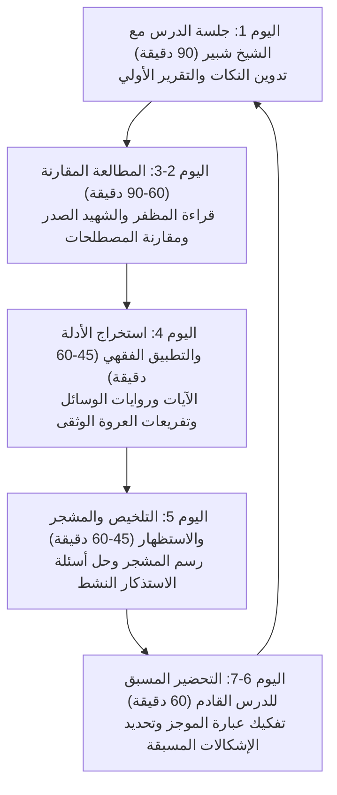

# برنامج دراسة «الموجز في أصول الفقه» مع الشيخ شبير

مرحباً بك في مستودع ومذكرات دراسة علم أصول الفقه الحوزوي. يمثل هذا المستودع بيئة متكاملة لمتابعة، تحضير، وتوثيق دروس كتاب **«الموجز في أصول الفقه» لآية الله الشيخ جعفر السبحاني (دام ظله)** مع أستاذك الفاضل **سماحة الشيخ شبير**، مع تعميق كل مسألة بدراسة مقارنة مع كبريات المتون الحوزوية (**أصول المظفر** و**حلقات الشهيد الصدر**)، واستنباط شواهدها من **القرآن الكريم** و**وسائل الشيعة**، وربطها بالتفاريع الفقهية في **العروة الوثقى**.

---

## 1. الدورة الأسبوعية للمذاكرة (3 - 5 ساعات أسبوعياً)

جلسة الدرس الأسبوعية مع الشيخ شبير مدتها **ساعة ونصف (90 دقيقة)**. ولتحقيق أقصى درجات الإتقان والرسوخ الذهني للمسائل الأصولية، تم تنظيم الجهد الأسبوعي على النحو التالي:



### تفصيل مهام الدورة الأسبوعية:
1. **اليوم 1 (جلسة الدرس - 90 دقيقة):**
   - الحضور بكامل الاستعداد والتركيز.
   - تدوين تقرير الدرس ونكات الأستاذ في **المرحلة الثانية** من ملف الدرس.
   - طرح أسئلة وإشكالات التحضير المسبقة على الشيخ شبير لفض أي غموض.
2. **اليوم 2 و 3 (المطالعة المقارنة - 60 إلى 90 دقيقة):**
   - فتح كتاب *أصول الفقه* للشيخ المظفر للمسألة المعنية وملاحظة صياغته وأدلته.
   - فتح *دروس في علم الأصول (الحلقات)* للشهيد الصدر لاكتشاف مسالكه التحليلية (كالقرن الأكيد، أو حق الطاعة، إلخ).
   - توثيق الفروق الدقيقة في جدول المقارنة بالملف.
3. **اليوم 4 (التأصيل الشرعي والتطبيق الفقهي - 45 إلى 60 دقيقة):**
   - استخراج شواهد المسألة من نصوص القرآن الكريم وروايات *وسائل الشيعة*.
   - ربط المسألة بفرع فقهي عملي من فصول *العروة الوثقى* (كتاب الطهارة أو الصلاة) ومعرفة كيف يختلف الحكم الفقهي باختلاف المبنى الأصولي.
4. **اليوم 5 (التلخيص، المشجر، والاستظهار النشط - 45 إلى 60 دقيقة):**
   - مراجعة وتعديل المشجر البياني (Mermaid Diagram) للمسألة.
   - إغلاق المتن واختبار الذاكرة بحل أسئلة الاستذكار النشط (Active Recall Prompts) ثم مطابقتها مع الإجابات المطوية.
5. **اليوم 6 و 7 (التحضير المسبق للدرس القادم - 60 دقيقة):**
   - قراءة المقطع التالي من كتاب *الموجز* قراءة استباقية فاحصة.
   - تفكيك العبارة الصعبة وتعيين محط الاستدلال.
   - صياغة 2 إلى 3 أسئلة دقيقة لتوجيهها للأستاذ في الجلسة القادمة.

---

## 2. معمارية المستودع وهيكل المجلدات

```text
Usul/
├── 00_المقدمة_والمبادئ/               # المبادئ التصورية والتصديقية، الوضع، الدلالات، المشتق
├── 01_مباحث_الألفاظ/                 # الأوامر، النواهي، المفاهيم، العموم والخصوص، المطلق والمقيد
├── 02_الملازمات_العقلية/             # المستقلات العقلية، مقدمة الواجب، مسألة الضد، الإجزاء
├── 03_الحجج_والأمارات/               # القطع، الظن، الكتاب، السنة، الإجماع، خبر الواحد، السيرة
├── 04_الأصول_العملية/                 # البراءة، التخيير، الاحتياط، الاستصحاب، والقواعد الفقهية
├── 05_تعارض_الأدلة/                  # التعارض، التزاحم، الجمع الدلالي، التراجيح، التساقط
├── Templates/                        # القالب الأصولي النموذجي خماسي المراحل
├── Tools/
│   └── usul.py                       # أداة بايثون للبحث والمطالعة واستخراج النصوص محلياً
├── Curriculum_Map.md                 # خريطة المنهج الحوزوي الكامل ومتابعة الدروس
└── README.md                         # هذا الدليل الإرشادي
```

---

## 3. استخدام أداة المساعدة الحوزوية (`Tools/usul.py`)

تم توفير سكريبت بايثون داخل `Usul/Tools/usul.py` يتيح لك التفاعل المباشر مع مكتباتك المحلية المستخرجة:

### أ) البحث في نصوص أصول الفقه (مكتبة نور):
```powershell
python Usul/Tools/usul.py search "الوضع" --author سبحاني
python Usul/Tools/usul.py search "القرن الأكيد" --author صدر
python Usul/Tools/usul.py search "المشتق" --author مظفر
```

### ب) استخراج نص من «الموجز»:
```powershell
python Usul/Tools/usul.py extract-mujaz "الأمر الأوّل"
```

### ج) إنشاء ملف درس جديد بالقالب الخماسي جاهزاً:
```powershell
python Usul/Tools/usul.py create-dossier "00_المقدمة_والمبادئ/02_حقيقة_الوضع_وأقسامه.md" "حقيقة الوضع وأقسامه"
```

### د) البحث عن الفروع الفقهية في «العروة الوثقى»:
```powershell
python Usul/Tools/usul.py fiqh-search "استصحاب"
```

---

## 4. إرشادات النجاح والتفوق في الدرس الحوزوي

1. **لا تذهب إلى الدرس بلا تحضير مسبق:**
   التحضير يجعلك تستمع للشيخ شبير كناقد وباحث شريك في صياغة الفكرة، لا مجرد متلقٍ سلبي.
2. **اهتم بـ «تحرير محل النزاع» أولاً:**
   أكثر المغالطات والجدل في الأصول يقع بسبب خلط ما هو داخل في البحث بما هو خارج عنه؛ فاحرص على تثبيت محل النزاع بدقة.
3. **اربط الأصل بالفرع:**
   الأصول بلا فقه كالشجرة بلا ثمر؛ ربطك لكل مسألة بفرع تطبيقي من *العروة الوثقى* هو ما يرسخ القاعدة ويجعلها ملكة فقهية حية لديك.
4. **مارس الاسترجاع النشط (Active Recall):**
   قراءة التلخيص لا تصنع الملكة؛ بل إغلاق الدفتر ومحاولة صياغة الإجابة ذاتياً ثم كشف الجواب النموذجي هو المفتاح الحقيقي للاجتهاد وترسيخ العلم.
