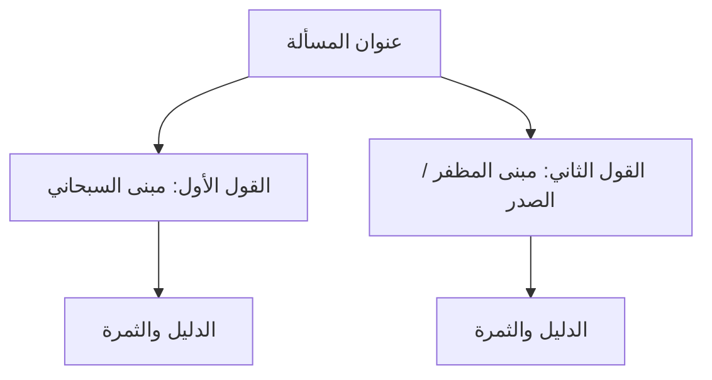

# [عنوان الدرس الأصولي]: [اسم المسألة الدقيق]

> **بيانات الجلسة:**
> - **الكتاب الأصل:** الموجز في أصول الفقه — سماحة آية الله الشيخ جعفر السبحاني (دام ظله)
> - **الباب والمقصد:** [المقدمة والمبادئ / مباحث الألفاظ / الملازمات العقلية / الحجج والأمارات / الأصول العملية / تعارض الأدلة]
> - **الصفحات في الموجز:** [ص: .. - ..]
> - **الأستاذ المُدرّس:** سماحة الشيخ شبير
> - **تاريخ الدرس:** [اليوم والتاريخ]
> - **حالة المسألة:** [ ] قيد التحضير المسبق | [ ] تم حضور الدرس وتدوين النكات | [ ] تمت المقارنة والأدلة | [ ] تم الاستظهار والترسيخ

---

## المرحلة الأولى: التحضير المسبق للدرس (Pre-Class Tahdhir)

### 1. نص عبارة «الموجز في أصول الفقه»
> *اقتباس النص الحرفي لمقطع الدرس من كتاب الموجز مع توثيق الصفحة بدقة:*
> 
> «...»

### 2. تحرير محل النزاع (تحقيق عنوان المسألة)
- **ما يدخل في حريم البحث:** 
- **ما خرج عن محط النظر تخصصاً أو تخصيصاً:**
- **جوهر التساؤل الأصولي:** 

### 3. المعجم المصطلحي وتفكيك الألفاظ
| المصطلح الأصولي | المعنى اللغوي العرفي | الاصطلاح الحوزوي الدقيق |
| :--- | :--- | :--- |
| **[مصطلح 1]** | ... | ... |
| **[مصطلح 2]** | ... | ... |

### 4. خلاصة دعوى المصنف (الشيخ السبحاني) وأدلته
- **المدعى المختار في الموجز:** 
- **الدليل الأول:** 
- **الدليل الثاني:** 
- **دفع الإشكال والدخل المقدر:** 

### 5. إشكالات التحضير وأسئلة للنقاش مع الشيخ شبير
- [ ] **سؤال 1 (حول سبك العبارة أو مراد المصنف):** ...
- [ ] **سؤال 2 (إشكال نقضي أو حلي على الاستدلال):** ...
- [ ] **سؤال 3 (استفسار حول ثمرة المسألة أو المقارنة):** ...

---

## المرحلة الثانية: تقرير الدرس ونكات الشيخ شبير (Unified Class Notes)

*(هنا تُدوّن جميع ملاحظات وتقرير جلسة الدرس مع الشيخ شبير في مساحة واحدة جامعة متكاملة)*

> ### 📝 تقرير الدرس الموحد (بيان الشيخ شبير، النكات، والردود):
> 
> *[اكتب هنا كامل تقرير الجلسة: بيان الأستاذ للمسألة، ترتيب الأدلة، النكات الرجالية أو اللغوية، وإجاباته على أسئلة التحضير وإشكالات المسألة...]*
> 
> ...
> 
> ---
> **تنبيهات وفوائد خاصة للأستاذ:**
> - ...

---

## المرحلة الثالثة: الدراسة المقارنة والأدلة الشرعية (Parallel Study & Primary Evidences)

### 1. تحقيق مذهب الشيخ المظفر في «أصول الفقه»
- **الموضع:** *أصول الفقه*، الجزء [ ]، الصفحة [ ].
- **تحرير المظفر للمسألة ومبناه:** ...
- **نقاط الوفاق والافتراق مع الشيخ السبحاني:** ...

### 2. تحقيق مذهب الشهيد الصدر في «دروس في علم الأصول»
- **الموضع:** *دروس في علم الأصول*، الحلقة [الأولى / الثانية]، بحث [ ].
- **الصياغة والابتكار التحليلي للشهيد الصدر:** (المسلك، التمييز الاصطلاحي، هندسة الدليل).
- **التقييم المقارن:** ...

### 3. وقفات تخصصية عند الأكابر (الأنصاري / الآخوند / الخوئي)
*(تُحرر في المسائل المفصلية ذات العمق الأصولي)*
- **موقف الآخوند الخراساني (كفاية الأصول):** ...
- **موقف السيد الخوئي (مصباح الأصول / محاضرات في أصول الفقه):** ...

### 4. جدول المقارنة الأصولية التركيبية
| المحور الأصولي | الشيخ جعفر السبحاني (الموجز) | الشيخ محمد رضا المظفر (الأصول) | الشهيد محمد باقر الصدر (الحلقات) | السيد الخوئي (المصباح) |
| :--- | :--- | :--- | :--- | :--- |
| **المبنى المعتمد** | ... | ... | ... | ... |
| **عمدة الدليل** | ... | ... | ... | ... |
| **موضع النقد** | ... | ... | ... | ... |

### 5. الأدلة الشرعية والعقلية
#### أولاً: الآيات القرآنية الكريمة
- **الآية:** ﴿ ... ﴾ [سورة: ...، آية: ...].
- **وجه الاستدلال (التقريب):** ...
- **المناقشة والإيراد:** ...

#### ثانياً: الروايات الشريفة (وسائل الشيعة)
- **الحديث:** عن [الإمام / الراوي]: «...» (*وسائل الشيعة*، كتاب: [...]، باب: [...]، حديث: [...]).
- **فحص السند بإيجاز:** ...
- **فقه الحديث والدلالة الأصولية:** ...

#### ثالثاً: الدليل العقلي / العقلائي
- **حكم العقل (الملازمة العقلية / التحسين والتقبيح):** ...
- **بناء العقلاء وسيرتهم القطعية:** ...

---

## المرحلة الرابعة: الثمرة الفقهية والتطبيقات العملية (Tatbiqat)

### 1. تحرير الثمرة الأصولية
- هل النزاع ذو ثمرة فقهية استنباطية أم هو نزاع لفظي/علمي مجرد؟
- كيفية انعكاس المبنى الأصولي على فتوى الفقيه: ...

### 2. التطبيق الفقهي من «العروة الوثقى»
- **المسألة الفقهية:** *العروة الوثقى*، كتاب [الطهارة / الصلاة / ... ]، فصل [ ]، مسألة رقم ([ ]).
- **متن المسألة الفقهية:** «...»
- **تخريج الفرع الفقهي على المباني الأصولية:** 
  - *بناءً على مبنى (المصنف السبحاني):* يترتب الحكم الفقهي (...).
  - *بناءً على مبنى (المظفر / الشهيد الصدر):* يترتب الحكم الفقهي (...).

### 3. فرع معاصر أو ابتلائي
- **المسألة المعاصرة:** ...
- **التخريج الأصولي:** ...

---

## المرحلة الخامسة: المشجر البياني والترسيخ والاستظهار (Active Recall)

### 1. المشجر المفاهيمي (Concept Tree Diagram)

### 2. أسئلة الاستذكار النشط (Active Recall Prompts)

#### س1: [حرر بدقة محل النزاع في المسألة وما الذي يخرج عنه؟]

<b>اضغط هنا لعرض الجواب النموذجي</b>

*الجواب:*
- ...

#### س2: [ما هو الفرق الدقيق بين مسلك الشيخ السبحاني ومسلك الشهيد الصدر؟]

<b>اضغط هنا لعرض الجواب النموذجي</b>

*الجواب:*
- ...

#### س3: [كيف تخرّج الفرع الفقهي الفلاني بناءً على مبنى القائلين بـ (...)؟]

<b>اضغط هنا لعرض الجواب النموذجي</b>

*الجواب:*
- ...

---
> **سجل المراجعة الدورية المتباعدة (Spaced Repetition Log):**
> - [ ] مراجعة 1: بعد 24 ساعة من الدرس (تاريخ: )
> - [ ] مراجعة 2: بعد 7 أيام مع الدرس التالي (تاريخ: )
> - [ ] مراجعة 3: مراجعة شهرية شاملة للباب (تاريخ: )
